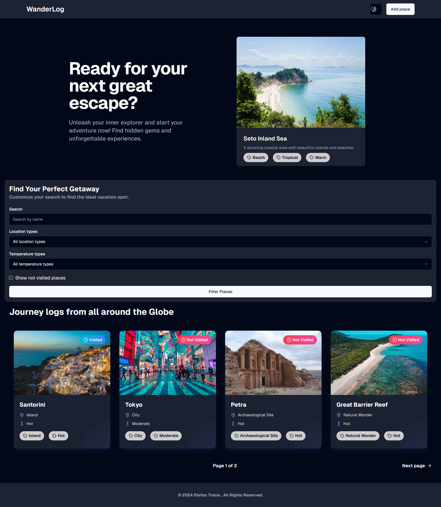

# WanderLog: Document Your Journeys, Plan Your Dreams 🗺️🌙

[Live Demo](https://wanderlog-self.vercel.app/)

## Description

WanderLog offers a user-friendly and visually appealing way to keep a record of all the incredible places you've experienced and those you're excited to explore. With a fully responsive design and integrated dark mode, WanderLog provides a seamless and enjoyable experience on any device.

## Screenshot

## Technologies Used

- **React.js**
- **Next.js**
- **Tailwind CSS**
- **Postgres**
- **Vercel**
- **Vercel Blob**
- **Prisma**
- **Clerk**

## Features

- **Intuitive Location Filtering:** Easily sort and filter your travel records by location type (e.g., city, country, landmark), temperature preference (e.g., warm, cold), name, or quickly view visited vs. planned locations.

- **Visual Location Overview:** Get a clear and organized view of all the places you've logged or intend to visit.

- **Effortless Location Entry:** Adding new destinations to your WanderLog is quick and straightforward, allowing you to easily document new discoveries and future plans.

- **Admin Control Panel:** (Admin Only) A dedicated dashboard for administrators to efficiently manage the platform by approving new location submissions and removing entries as needed.

## License

This project is licensed under the MIT License. See the [LICENSE](LICENSE) file for more details.
